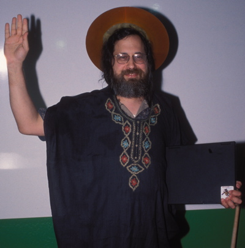

% An introduction to Free Monads
% Blas Rabella Mariscal
% 23/11/2017

# Introduction

I am here to explain you about the `Free` monad, but I don't really know much about it...

We wont talk about:  

* CoFree CoMonad
* Free Applicatives
* Category Theory

# So let's see...

What is it `Free`?

# Free as in Freedom



# Free as in Beer


# I don't have the answer...

It would be, to my view, a mix of both kinds of `Free`. And I will expose why.  

# Some definitions

Let's see what the Haskell `free` library says:

## Haskell

The `Free Monad` for a `Functor f`.

Formally

A Monad `n` is a free Monad for `f` if every monad homomorphism from `n` to another monad `m` is equivalent to a natural transformation from `f` to `m`.

Why Free?

Every "free" functor is left adjoint to some "forgetful" functor.

If we define a forgetful functor `U` from the category of monads to the category of functors that just forgets the Monad, leaving only the Functor. i.e. `U (M,return,join) = M` then Free is the left adjoint to `U`.

Being Free being left adjoint to `U` means that there is an isomorphism between `Free f -> m` in the category of monads and `f -> U m` in the category of functors.

# Sum moar...

## Haskell 2

Morphisms in the category of monads are Monad homomorphisms (natural transformations that respect return and join).

Morphisms in the category of functors are Functor homomorphisms (natural transformations).

Given this isomorphism, every monad homomorphism from `Free f` to `m` is equivalent to a natural transformation from `f` to `m`

Showing that this isomorphism holds is left as an exercise.

In practice, you can just view a `Free f a` as many layers of `f` wrapped around values of type `a`, where (`>>=`) performs substitution and grafts new layers of `f` in for each of the free variables.

This can be very useful for modeling domain specific languages, trees, or other constructs.

# And scala?

This would be the description according to `Scala` `cats` library:

## Scala

A free monad is a construction which allows you to build a monad from any Functor. Like other monads, it is a pure way to represent and manipulate computations.

In particular, free monads provide a practical way to:

* represent stateful computations as data, and run them

* run recursive computations in a stack-safe way

* build an embedded DSL (domain-specific language)

* retarget a computation to another interpreter using natural transformations

(In cats, the type representing a free monad is abbreviated as Free[_].)

# What we can take from this?

* It is a way to create recursive structures.

* We get a Monad for free AND free of effects.

* Edward Kmett is some kind of semi-god (`free` `recursion-schemes` `lens` `kan-extension` `either` ...)

* I need to study muuuuuch more.

# Some theory

## Or some code...

```haskell
data Free f a where
  Pure :: a -> Free f a
  Free :: f (Free f a) -> Free f a

instance Functor f => Functor (Free f) where
  fmap f (Pure a) = Pure (f a)
  fmap f (Free a) = Free (fmap (fmap f) a)

instance Applicative f => Applicative (Free f) where
  pure = Pure
  Pure f <*> a = fmap f a
  Free f <*> Pure a = Free $ fmap (fmap ($ a)) f
  Free f <*> Free a = Free (fmap (<*>) f <*> a)
```
# Some more code

## 

```haskell
instance Applicative f => Monad (Free f) where
  Pure a >>= k = k a
  Free a >>= k = Free (fmap (>>= k) a)
  
liftF :: (Functor f) => f r -> Free f r
liftF command = Free (fmap Pure command)
```

# Example 1: Hanoi Towers

```
  |    |     |
  +    |     |
 +++   |     |
+++++  |     |
--+----+-----+--
```
```
  |     |     |
  |     |     +
  |     |    +++ 
  |     |   +++++
--+-----+-----+----
```

# Example 1: Hanoi towers

Solving this problem is:

* Move `n-1` to `aux` peg

* Move `n` peg to `dest` peg

* Move `n-1` to `dest` peg

Let's build a DSL that let's us move pieces from peg to peg !!!

# Example 2: Programming a microcontroller

Let's imagine we want to:

* Read a value from the pin `n`

* Write to pin `n` a discrete value

* "Invert" the value of a certain pin

* End the program

Suppose it is for a library for `C++` developers, or whatever we might like.

# What we get from this?

* We are closer to Lisp :D as Code is Data, Data is Code...

* This means that we can decouple syntaxis/semantics from evaluation, so for example we can MOCK the full system.

* Let the interpreter decide how to evaluate the code. We can have a "cheap" interpreter for debugging and an "expensive" for real execution.

* More decoupled systems. Easier composability, easier testing...

* Really easy to build your own `monadic` DSL.

* Some degree of reflexion

# Is it useful???

**THIS ARE MY OPINIONS**

I don't believe it is... ...in a normal development environment.

There are amazing usages but they mostly depend on highly skilled teams.

Anyhow, it is a really useful tool that opens a lot of possibilities.

# What more

Well...

* The interpreter could/should use `Cofree Comonads`. I let it as a "trivial" exercise for the you, and a possible next meeting.

* This is not really an efficient implementation, you can check: `Control.Monad.Free.Church` wich is _asymptotically_ more efficient. [link](https://hackage.haskell.org/package/free-4.12.4/docs/Control-Monad-Free-Church.html)
